# Soulmate   
## Finding User Flag   

Scan using Nmap, we found port 22 and 80.

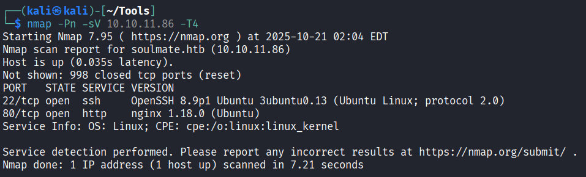    

Add `soulmate.htb` to `/etc/hosts`.

Turns out there's nothing worth viewing in soulmate.htb, no XSS or File Upload attacks effective.  Let's try to fuzz the vhosts

```
ffuf -w /usr/share/seclists/Discovery/DNS/subdomains-top1million-5000.txt:FUZZ -u http://soulmate.htb/ -H 'Host: FUZZ.soulmate.htb' -fs 154
```

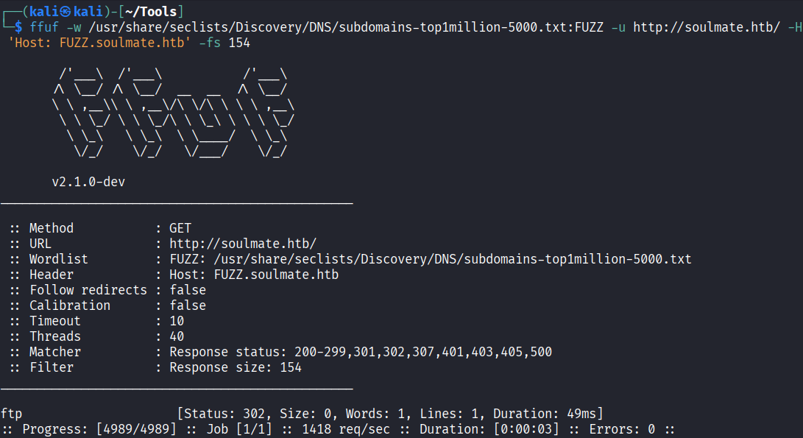    

Found `ftp`. Let's add `ftp.soulmate.htb`  to `/etc/hosts`  and go to the website.

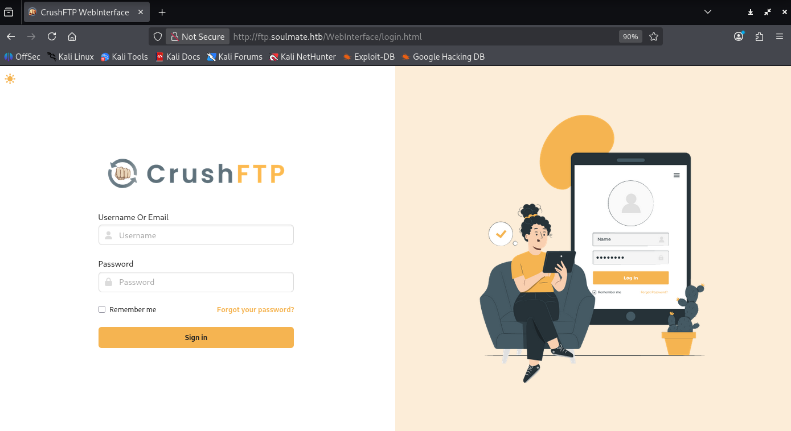    

It's difficult to find the version only from the CrushFTP login page, but I found a working exploit for authentication bypass [https://github.com/f4dee-backup/CVE-2025-31161.git](https://github.com/f4dee-backup/CVE-2025-31161.git)    

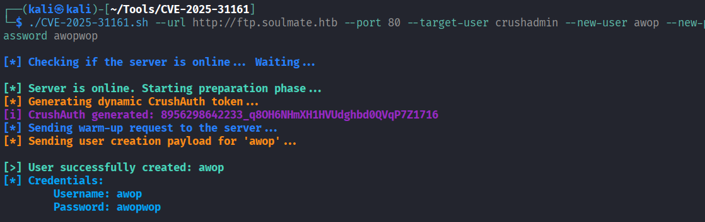    

Yayy can log in   

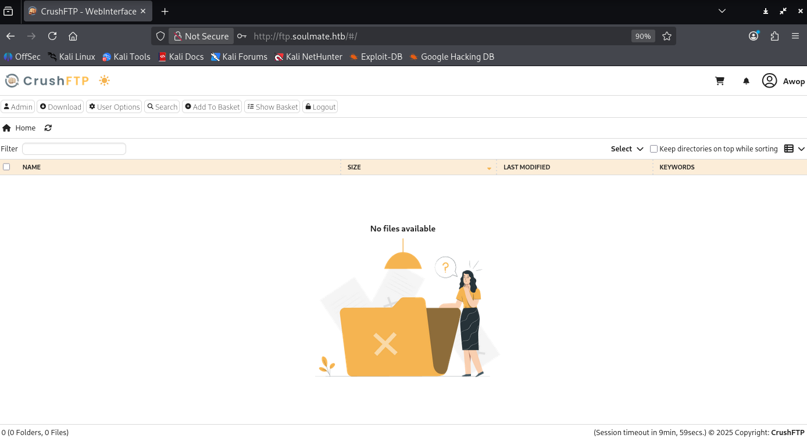    

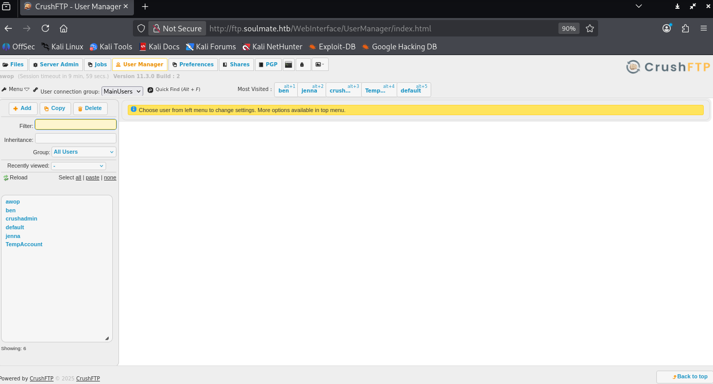    

So, tt has the version 11.3.0 build 2. Let's reset the users passwords as we got admin privilege here.

Based on the folder names, the most promising user is Ben, as in user manager settings, ben have are `webProd`  shares that may be used to upload php files (including shells!). Take note of the newly generated credentials.

`ben:988BFQ`    

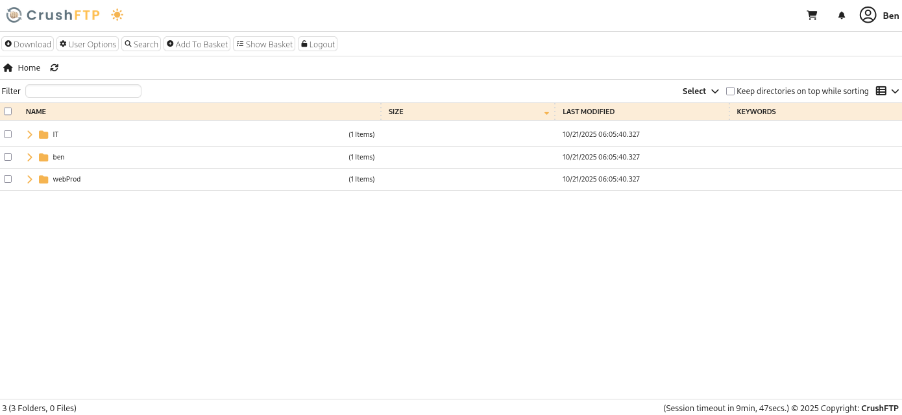    

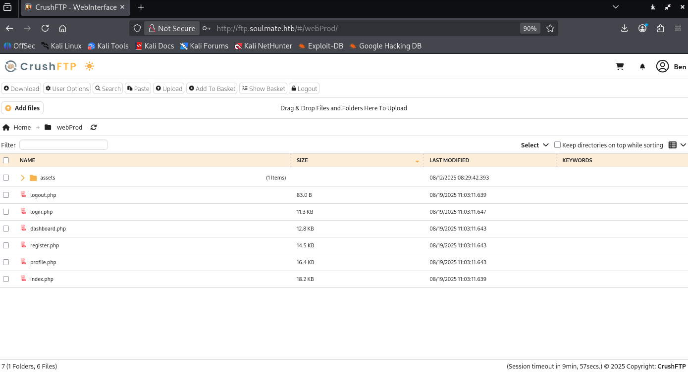    

Now we can upload file to the prod, let's upload the `webshell/`    

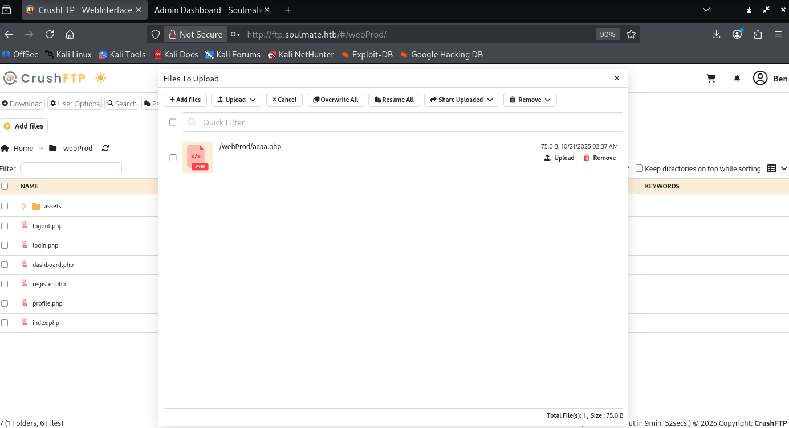    
 
 It works!   

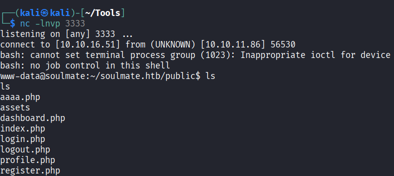    

Let's check the data inside, there's `config/config.php`  and `data/soulmate.db`  here.   

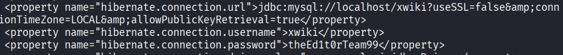    

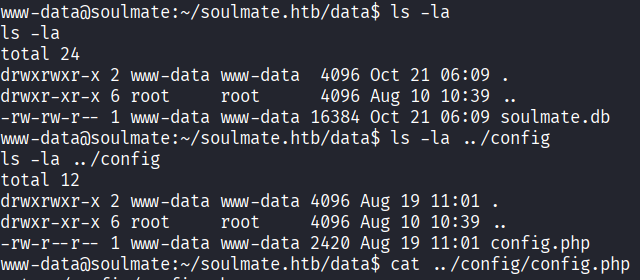    

]Wow, interesting code snippet!   

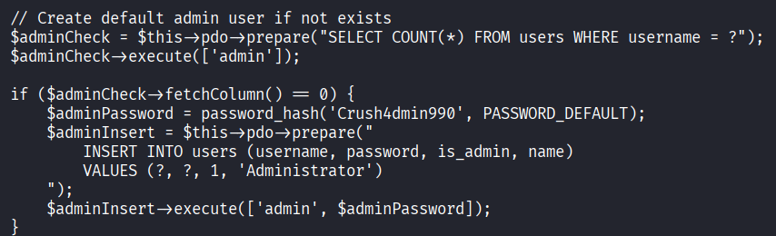    

Let's login to `soulmate.htb` using `admin:Crush4dmin990`. This may be naive, but let's SSH using that credentials. NAhh it can't :(  should be obvious from the password string. 

Let's do another classic Linux reconnaissance commands. One of them that gives interesting info is `netstat -tulnp` .   

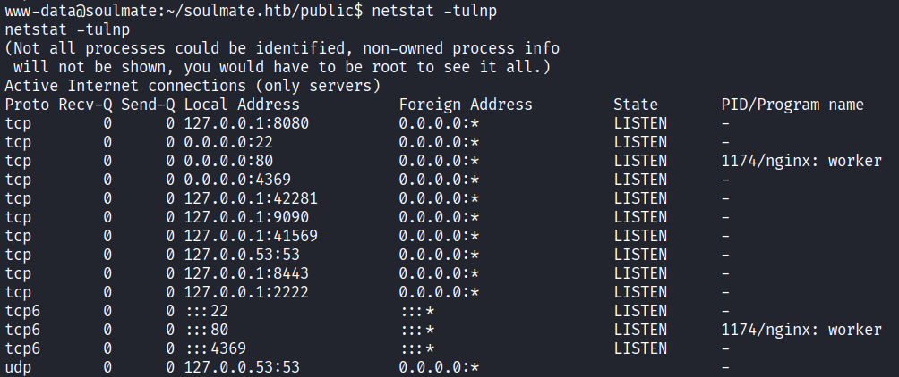    

There are 22, 80, and 4369. 22 is the default SSH port, 80 is the webpage itself, and.. 4369? Let's check on internet. Oh, it's the default port for Erlang stuffs or RabbitMQ stuffs (tbh I'm not familiar with it). But let's do more recon by using the `erl` command.

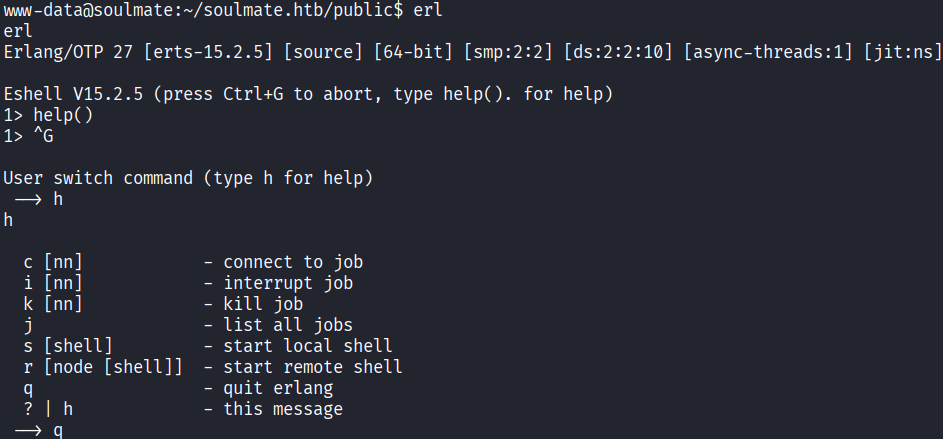    

It works. Let's find out the `erl`  command location   

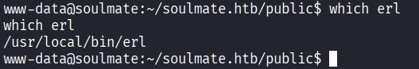    

Not really.. helpful? Based on some searches, the configuration files is in `/usr/local/lib/erlang`.

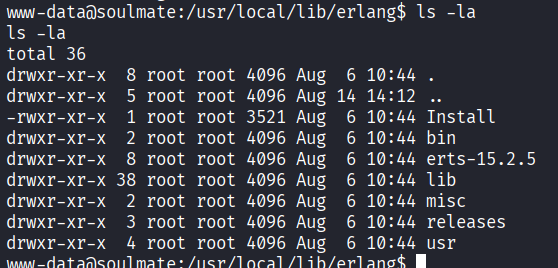    

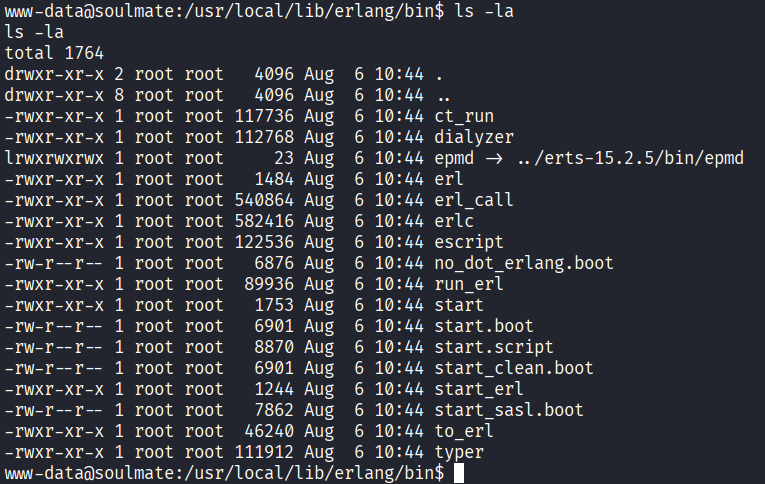    

Eh it seems there's nothing worthy. Let's check `lib/erlang\_login`  folder

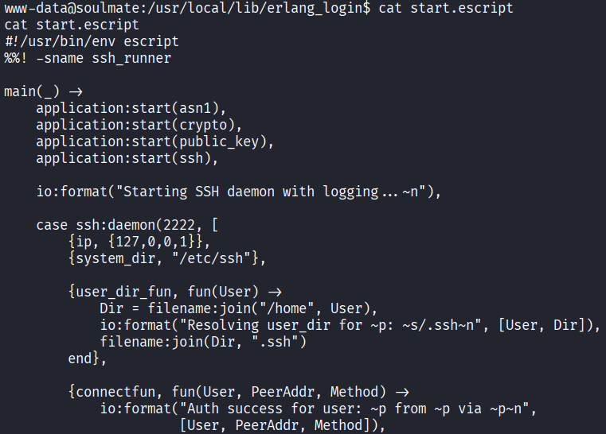    

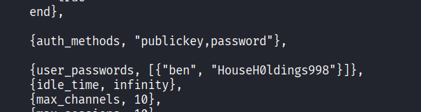    

Wow there's another credentials! and based on the code, it seems that it's for… ssh stuffs? Interesting. `ben:HouseH0ldings998`   

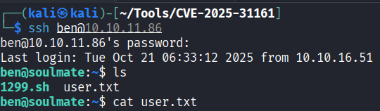

Found it!
## Finding Root Flag   

In home directory, there's `1299.sh` script.   

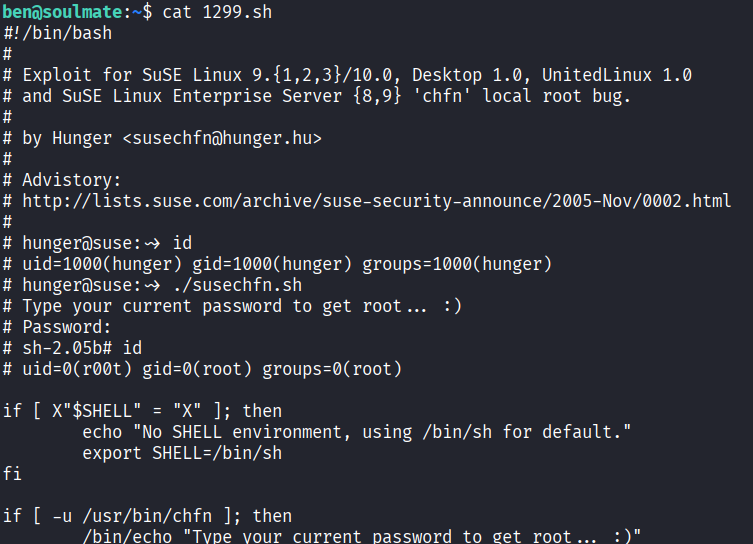    

The code are indeed suspicious, but when we check what OS we're in…   

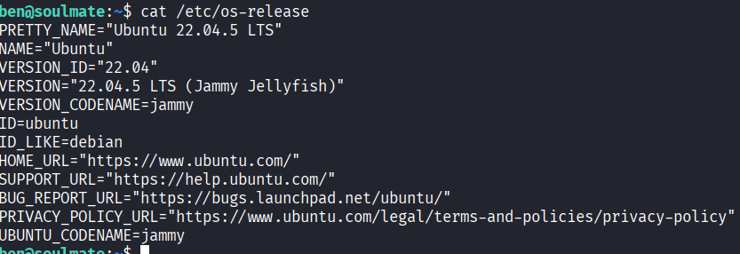    

ubunyu!  

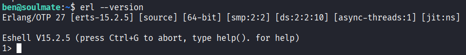    

I'm finding that using linpeas bears no fruit, so let's do recon some more. In our previous `netstat -tuln`  command, there's another port that opens only in localhost (`127.0.0.1:2222` ). Let's try to connect using same credentials.

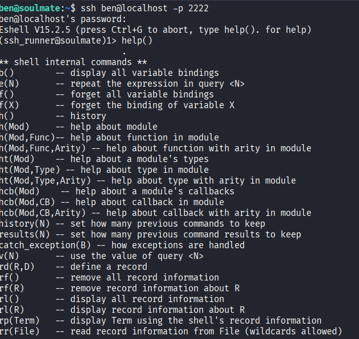    

Oh? TIL Erlang has its own ssh runner, and in help command, there's `os:cmd()`  command…   

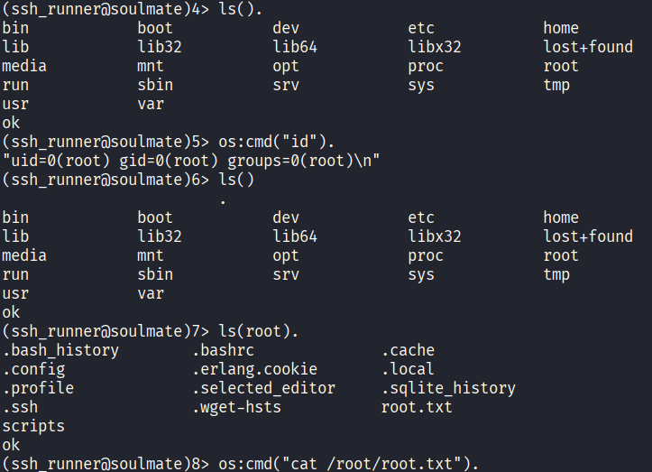
